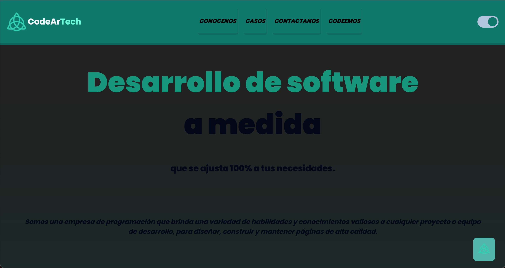

# CodeAr Tech
## Objetivo 
Este repositorio  CodeAr  Tech  servicios  de  desarrollo web  es  el  TP0  a  presentar  en  Codo  a  Codo  FullStack Python. 
Consta de cuatro paginas que presentaremos a continuacion:
## Index 
<picture>
  
</picture>

Nos presentamos aportando valor 

## Conocenos 
<picture>
  
</picture>

En total somos cuatro integrantes dedicados a este proyecto...

<picture>
  
</picture>

Nos presentamos aportando valor

## Casos 
<picture>
  
</picture>

Nos presentamos aportando valor

## Contactenos 
<picture>
  
</picture>

Nos presentamos aportando valor
## Codeemos 
<picture>
  
</picture>

Nos presentamos aportando valor
