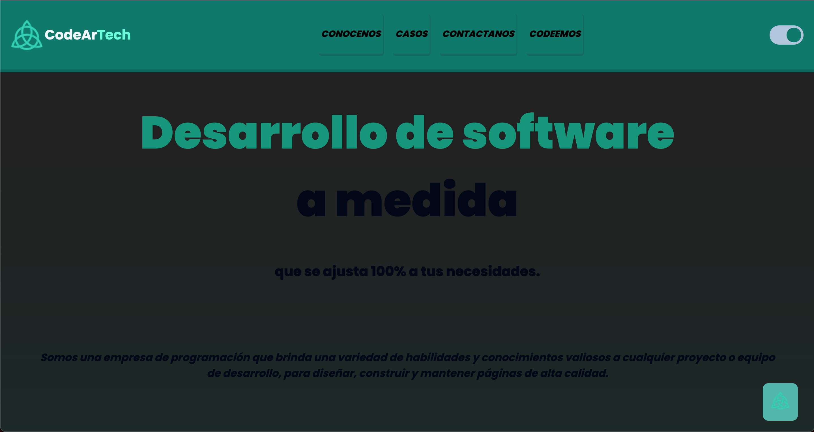
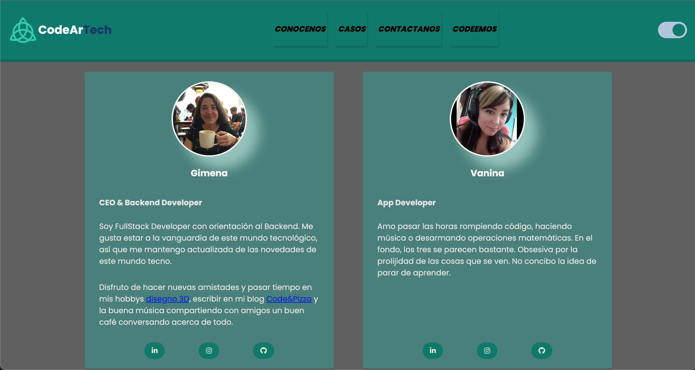
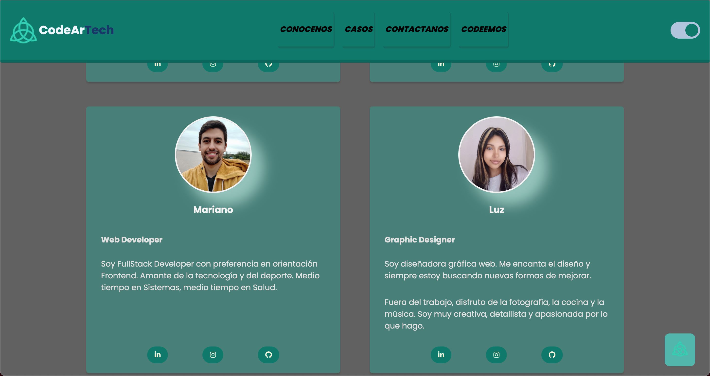

# CodeAr Tech
## Objetivo 
Este repositorio  CodeAr  Tech  servicios  de  desarrollo web  es  el  TP0  a  presentar  en  Codo  a  Codo  FullStack Python. 
Consta de cuatro paginas que presentaremos a continuacion:
## Index 
<picture>
  
</picture>

Nos presentamos aportando valor 

## Conocenos 
<picture>
  
</picture>

En total somos cuatro integrantes dedicados a este proyecto...

<picture>
  
</picture>

Nos presentamos aportando valor y elevando el potencial de nuestros clientes. 

## Casos de Exito 

Presentamos a clientes que confiaron en nosotros. 

## Contactenos 

Los usuarios pueden escribirnos a traves del formulario. 

## Codeemos 

Invitamos a profesionales a trabajar con nosotros.  

## Blog 

Cada integrante escribe sobre un tema de interes. 

